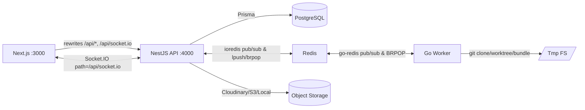

# Relax-Git 技术总览（说人话版 + 详细版）

## 说人话版

- **这是啥**：一个“像 GitHub 一样能看代码、讨论和聊天”的现代协作平台，重点是“导入仓库 → 生成快照 → 浏览代码 → 评论/通知/聊天”。
- **怎么跑**：一个容器跑全栈。Next.js 对外（端口 3000），NestJS API 在内部（端口 4000），Go
  Worker 在后台。Next 用 rewrites 代理 API 和 WebSocket。
- **为啥这么设计**：
  - 同源代理，Cookie/JWT/WS 都省心，跨域问题少。
  - Go Worker 专做 Git：clone/worktree/bundle，高性能且不堵住 Node。
  - Redis 串起队列和发布订阅，API/WS/Worker 三方通信简单稳。
- **关键亮点**：
  - 快照“自愈”：READY 但路径缺失时自动排查并重试。
  - WS 秒回执：订阅 `snapshot:status:*`，前端实时更新。
  - 上传统一：头像/仓库封面都走 `UploadService`，优先 Cloudinary。

## 详细版

### 架构与端口

- 前端（Next.js）：对外端口 `3000`。重写/代理 `/api/*` 与 `/api/socket.io` 到内部 API。
- 后端（NestJS + Fastify）：固定内部端口 `4000`。`IoAdapter` 附着 HTTP 服务器，WebSocket 路径
  `/socket.io`。
- Worker（Go）：后台进程消费队列，执行
  `git clone/worktree/bundle`，更新数据库并通过 Redis 发布状态。
- 队列与发布订阅：Redis 列表 `snapshot:queue` + 频道 `snapshot:status:<id>`。
- 数据库：PostgreSQL（Prisma）。

### 技术栈与关键文件

- 前端：Next 15、`next-auth@5`、`socket.io-client@4`、React Query 5、MUI/Tailwind。
  - `apps/web/next.config.js`：`rewrites()`、`images.domains`、WS 代理尾随斜杠修复。
  - `apps/web/src/middleware.ts`：认证拦截，放行 `/`、`/auth/*`、`/health`。
  - `apps/web/src/lib/auth.ts`：Credentials 登录，SSR 代理写 Cookie，JWT 存 session。
- 后端：Nest 10 + Fastify、Socket.IO、Prisma + Postgres、ioredis、OpenAI SDK（智谱网关）。
  - `apps/api/src/main.ts`：`IoAdapter`、CORS、Swagger、静态 `/uploads`、端口从 `API_PORT`。
  - `apps/api/src/app.module.ts`：模块编排，全局 `JwtAuthGuard`。
  - `apps/api/src/auth/strategies/jwt.strategy.ts`：Cookie `access_token` 优先，回源校验。
  - `apps/api/src/auth/services/token.service.ts`：签发/旋转 Refresh（JTI 存 Redis）、写 HttpOnly
    Cookie。
  - `apps/api/src/websocket/websocket.gateway.ts`：握手取 JWT、房间管理、`psubscribe('snapshot:status:*')`
    转发。
  - `apps/api/src/redis/redis.service.ts`：三客户端（主/发布/订阅），封装
    `enqueue/dequeue/publish/psubscribe`。
  - `apps/api/src/snapshots/base-snapshot.service.ts`：创建/入队/幂等 `ensureArtifact()`。
  - `apps/api/src/snapshots/artifacts.controller.ts`：`/api/artifacts/:id/status|tree|file|retry|by-branch`，含自愈逻辑。
  - `apps/api/src/snapshots/services/unified-snapshot.service.ts`：路径自愈（Windows→Linux）、会话快照共享。
  - `apps/api/src/upload/upload.service.ts`：Cloudinary/S3/Local 三态上传，`CLOUDINARY_ENABLED`
    字符串解析。
- Worker（Go）：
  - `apps/worker/worker/processor.go`：并发消费、DB 写、发布状态。
  - `apps/worker/git/operations.go`：clone/worktree/bundle（`--all`）、代理支持、启动清理。
  - `apps/worker/database/postgres.go`：`::base_snapshot_status` 显式枚举 cast + 写后读校验日志。
  - `apps/worker/queue/redis.go`：BRPOP、Publish、状态缓存。

### 核心业务链路（快照）

1. 导入仓库 → `BaseSnapshotService.createBaseSnapshot()` 将记录设为 `QUEUED` 并
   `lpush('snapshot:queue')`。
2. Worker `BRPOP` 消费：`git clone → worktree → bundle`，DB 写入路径并置 `READY`。
3. Worker `publish('snapshot:status:<id>')`，API WS 网关 `psubscribe` 转发到 `snapshot:<id>` 房间。
4. 前端收到 `snapshot:status-changed`，调用 `/api/artifacts/:id/tree|file` 渲染代码。

### 健康与安全

- 健康检查：`/api/health`（Railway 健康检查路径）。
- 安全：全局 `JwtAuthGuard`、CORS 白名单、Rate Limit（Redis）与路径净化（防遍历）。
- 连接限制：WS 每用户最多 5 连接，未认证强制断开。

### 环境变量关键项

- 端口：`PORT=3000`（Web 对外）、`API_PORT=4000`（API 内部）。
- 域名：`NEXTAUTH_URL`、`NEXT_PUBLIC_APP_URL`、`CORS_ORIGIN` 一致。
- 代理：`NEXT_PUBLIC_API_URL=http://localhost:4000`，WS 用 `/api/socket.io`。
- JWT：`JWT_SECRET`、`JWT_ACCESS_TTL_MINUTES`、`JWT_REFRESH_TTL_DAYS`。
- Upload：`CLOUDINARY_ENABLED`、`CLOUDINARY_*`、或 `S3_*`。

## 基础理解（端到端心智模型）

- **[快照是什么]** `BaseSnapshot` 表示“某仓库某分支某 commit 的一次可复用产物”，字段含
  `status/processedAt/worktreePath/bundlePath`。`SessionSnapshot` 是“用户临时会话视角”，通常共享
  `BaseSnapshot` 的工作树（只读）。
- **[状态机]** `QUEUED → PROCESSING → READY/FAILED`。`processedAt`
  不为空意味着 Worker 已结束处理；若 `READY` 但 `worktreePath` 缺失，API 端会触发“自愈”。
- **[一次浏览代码]**
  1. 前端点击“浏览代码” → 请求
     `GET /api/artifacts/by-branch/:repoId/:branchId`（`ArtifactsController`）。
  2. 若没产物，`BaseSnapshotService.ensureArtifact()` 创建/复用并 `lpush snapshot:queue`。
  3. Worker `BRPOP` 消费 → `git clone → worktree → bundle --all`
     → 回写 DB（`READY + worktreePath`）→ `publish snapshot:status:<id>`。
  4. API WS 网关 `psubscribe` 到状态频道并转发到房间 `snapshot:<id>`；前端收到事件后拉取 `/tree`
     `/file` 渲染。
- **[一次上传封面图]**
  1. 前端表单 `POST /api/repositories/:id/cover`。
  2. `UploadService.uploadRepositoryCover()`
     根据开关优先 Cloudinary（否则 S3/本地），成功后返回可公网访问的 URL。
  3. 前端通过 Next Image 渲染；确保 `next.config.js images.domains` 包含 `res.cloudinary.com`。
- **[为什么“同源代理”]** Next `rewrites` 将 `/api/*` 与 `/api/socket.io` 代理到 API：
  - Cookie（HttpOnly）天然携带，SSR/WS 均可用；避免跨域与复杂 CORS/CSRF 处理。
  - WS 目标使用 `/socket.io/`（尾随斜杠）以兼容 Engine.IO。
- **[常见误区]**
  - WS 握手 404：未走 `beforeFiles` 或目标端缺少尾随 `/socket.io/`。
  - `READY` 但打不开文件树：Windows 路径写入导致；由 `UnifiedSnapshotService.autoFixWindowsPath()`
    修复或重入队。
  - Cloudinary 未生效：`CLOUDINARY_ENABLED` 是字符串，需显式解析为布尔；查看启动日志确认。
